# Description of Project

Macropal is a minimal health application that allows users to input specific data and goals about themselves and the app will return a daily calorie and macronutrient count

Then the user can select foods for breakfast , lunch, and dinner using the menu choices for protein, fat, and carbs.

Once these selections are made and submitted; a weekly grocery list will be generated with said foods in appropriate quantities.

Users can also search food nutritiion data via the search option.

# Screen Shots & Video

##Video [Short Tuturial of MacroPal](https://youtu.be/nFRyw5iEEaw)

## Mobile view screen shots
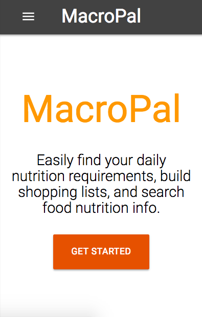

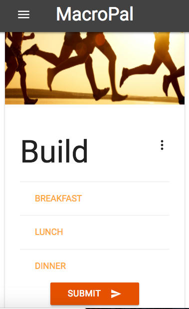

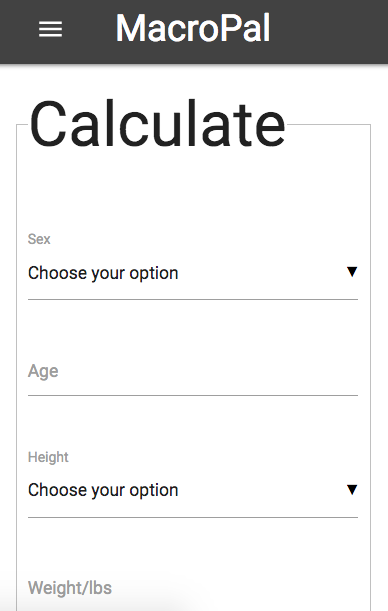

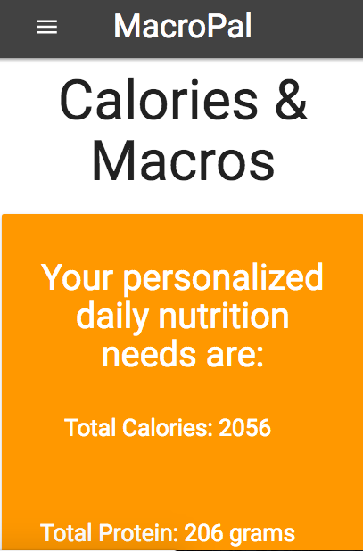

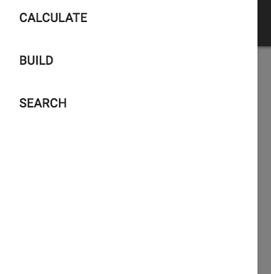

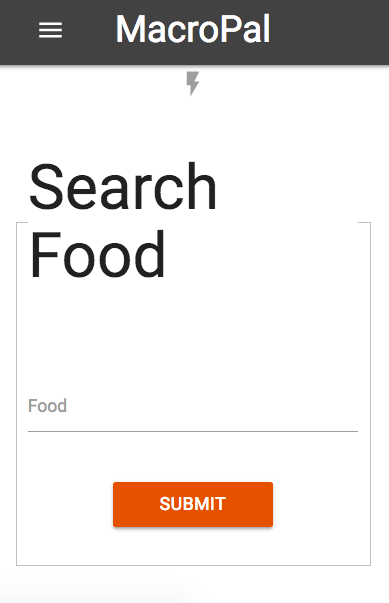

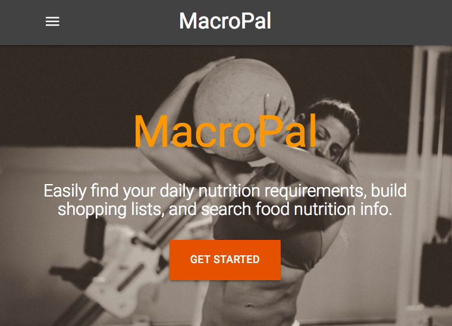

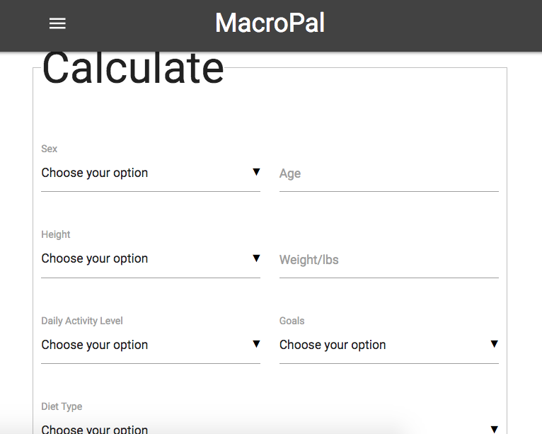

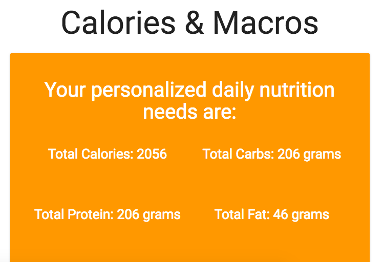

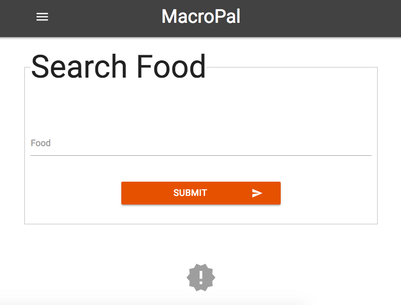

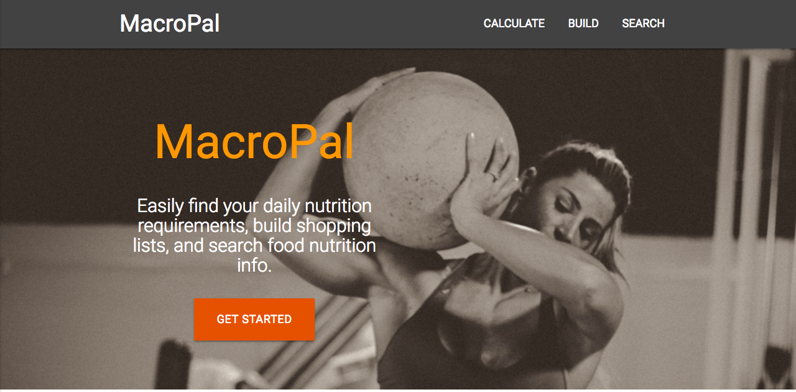

## Video Tutorial

# Technology Used
- HTML
- CSS
- SASS
- JavaScript
- jQuery
- Materialize
- API

# Licenses

**Not Applicable**
